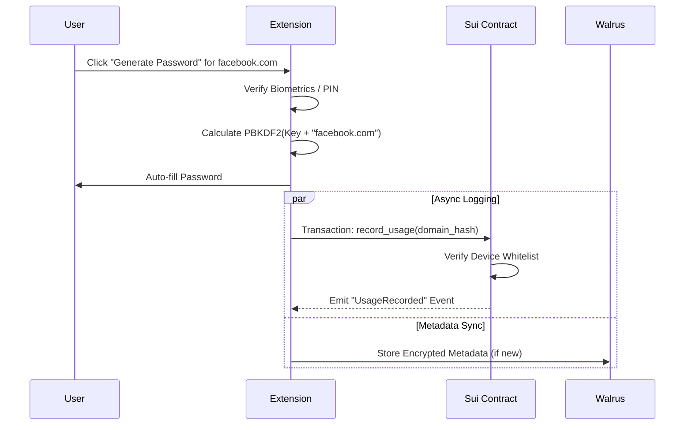

# Pass.me - Decentralized Password Manager

[](https://opensource.org/licenses/MIT)
[](https://sui.io/)
[](https://walrus.xyz/)
[](https://www.typescriptlang.org/)
[](https://sui.io/zklogin)

**Pass.me** is a radically secure, decentralized password manager that eliminates the "honeypot" risk of centralized vaults. Powered by **Sui Blockchain**, **Walrus Storage**, and **zkLogin**, it generates passwords deterministically on-demand and provides real-time breach alerts—ensuring your credentials are never stored, only calculated.

> **Hackathon Theme**: Decentralized Identity & Security
> **Built for**: Sui Overflow Hackathon
> **Live on**: Sui Testnet

---

## 🎯 Table of Contents

- [What Inspired This Project](#-what-inspired-this-project)
- [Overview](#overview)
- [Key Features](#key-features)
- [Architecture](#architecture)
- [Technology Stack](#technology-stack)
- [Project Structure](#project-structure)
- [Getting Started](#getting-started)
- [Smart Contracts](#smart-contracts)
- [Use Cases](#use-cases)
- [What We Learned](#-what-we-learned)
- [How We Built Pass.me](#-how-we-built-passme)
- [Challenges We Faced](#-challenges-we-faced)
- [Deployment](#deployment)
- [Roadmap](#roadmap)
- [Contributing](#contributing)
- [License](#license)

---

## 🌟 What Inspired This Project

The inspiration for Pass.me came from a fundamental flaw in how we secure our digital lives: **Centralized Vaults are Honeypots.**

### The Password Paradox
In 2022, LastPass suffered a catastrophic breach where encrypted user vaults were stolen. Millions of users realized that their "secure" password manager was actually a single point of failure. If an attacker cracks your master password, they have the keys to your entire digital kingdom.

We asked ourselves: **"What if we didn't store passwords at all?"**

### The "Stateless" Vision
Most password managers are just encrypted databases. We wanted to build a **computational** password manager. Instead of retrieving a stored password, Pass.me **calculates** it on the fly using your private key and the domain name.

`Password = Function(Private Key, Domain, Timestamp)`

This means there is **no database of passwords to hack**. Even if our servers are compromised, your passwords simply _aren't there_.

### The Privacy Gap
We also noticed that breach detection is reactive. You find out months later that your data was sold on the dark web. By leveraging **Sui's high-speed blockchain events**, we realized we could build a **Real-Time Security System** that alerts you the _second_ a suspicious login attempt occurs.

---

## 🌟 Overview

Pass.me addresses critical security flaws in traditional identity management by leveraging Sui's decentralized infrastructure.

### Problems We Solve
1.  **Centralized Honeypots**: Traditional password managers store all eggs in one basket.
2.  **Delayed Breach Notification**: Users are often the last to know about security incidents.
3.  **Password Reuse**: 52% of users reuse passwords because remembering unique ones is impossible.
4.  **Key Management Fatigue**: Managing private keys/seed phrases is a barrier to entry for non-crypto users.

### Our Solution
Pass.me creates a **trustless, deterministic security layer** where:
-   **Passwords are Generated, Not Stored**: Using PBKDF2 and local encryption.
-   **Metadata is Decentralized**: Encrypted vault metadata lives on **Walrus**, ensuring censorship resistance.
-   **Access is Verifiable**: Every "access" event is recorded on **Sui**, creating an immutable audit trail.
-   **Login is Seamless**: **zkLogin** allows users to authenticate with Google or Apple, removing the need for seed phrases.

---

## 🚀 Key Features

### Core Capabilities

✅ **Deterministic Password Generation**: Passwords are calculated on-the-fly using `PBKDF2(Key + Domain)`. They exist only in memory for the split second you need them.

✅ **Real-Time Breach Alerts**: The backend listens to Sui blockchain events. If a password is generated on an unknown device, you get an instant alert.

✅ **zkLogin Integration**: Sign in with your existing Google or Apple account. Zero-knowledge proofs link your Web2 identity to your Web3 vault without revealing your private data.

✅ **Walrus Decentralized Storage**: Encrypted metadata (like which domains you have passwords for) is stored as blobs on Walrus, ensuring data availability and privacy.

✅ **Device Whitelisting**: Smart contracts enforce access control. Only devices you explicitly approve can generate passwords for your vault.

✅ **Guardian Recovery**: Lost your access? A threshold of trusted friends (Guardians) can help you recover your vault, powered by Sui Move logic.

---

## 🏗️ Architecture

### System Overview

```mermaid
%%{init: {'theme':'dark', 'themeVariables': { 'primaryColor':'#3b82f6', 'primaryTextColor':'#fff', 'primaryBorderColor':'#fff', 'lineColor':'#fff'}}}%%
flowchart TD
    subgraph Client["Client Layer"]
        Ext["Browser Extension<br/>(Next.js/React)"]
        Auth["zkLogin Auth<br/>(Google/Apple)"]
    end

    subgraph Backend["Backend Layer"]
        API["Node.js API<br/>(Express)"]
        Listener["Event Listener<br/>(Sui SDK)"]
        Socket["WebSocket Server<br/>(Real-time Alerts)"]
    end

    subgraph Blockchain["Sui Network"]
        Vault["Vault Contract"]
        Entry["Password Entry"]
        Alert["Alert System"]
        ZK["zkLogin Verifier"]
    end

    subgraph Storage["Storage Layer"]
        Walrus["Walrus Protocol<br/>(Encrypted Blobs)"]
    end

    Auth --> Ext
    Ext -->|Generate/Sign| Vault
    Ext -->|Store Metadata| Walrus
    
    Vault -->|Emit Event| Blockchain
    Entry -->|Check Access| Blockchain
    
    Blockchain -->|Event Stream| Listener
    Listener -->|Trigger| Socket
    Socket -->|Push Alert| Ext

    style Ext fill:#1a1a1a,stroke:#3b82f6,stroke-width:2px
    style Vault fill:#1a1a1a,stroke:#3b82f6,stroke-width:2px
    style Walrus fill:#1a1a1a,stroke:#22c55e,stroke-width:2px
```



### User Flow: Password Generation



---

## 🛠️ Technology Stack

### Blockchain & Smart Contracts
-   **Sui Move**: 2024.beta edition for object-centric smart contracts.
-   **@mysten/zklogin**: For Web2-friendly authentication.
-   **Sui Testnet**: Current deployment environment.

### Frontend & Extension
-   **Next.js 16**: Using the App Router for the dashboard.
-   **React 19**: For the UI components.
-   **Tailwind CSS v4**: For styling.
-   **Webpack**: For bundling the Chrome Extension background scripts.
-   **Lucide React**: For iconography.

### Backend
-   **Node.js & Express**: REST API and orchestration.
-   **WebSockets (ws)**: For pushing real-time alerts to the client.
-   **node-cron**: For scheduled maintenance tasks.

### Storage
-   **Walrus**: Decentralized blob storage for encrypted user data.

---

## 📁 Project Structure

```bash
pass.me/
├── backend/                 # Node.js Express Server
│   ├── src/
│   │   ├── controllers/     # API Logic
│   │   ├── services/        # Sui & Walrus Integrations
│   │   └── index.ts         # Entry Point
│   └── package.json
│
├── contracts/               # Sui Move Smart Contracts
│   ├── sources/
│   │   ├── vault.move       # Core Vault Logic
│   │   ├── password_entry.move
│   │   ├── alert_system.move
│   │   └── zklogin_integration.move
│   └── Move.toml
│
└── frontend_extension/      # Next.js App + Chrome Extension
    ├── app/                 # Next.js App Router (Dashboard)
    ├── components/          # React Components
    ├── lib/                 # Shared Utilities (Sui Client)
    ├── public/              # Static Assets
    ├── scripts/             # Build scripts for extension
    └── package.json
```

---

## 🎬 Getting Started

### Prerequisites
-   Node.js v18+
-   pnpm or npm
-   Sui CLI installed
-   Walrus CLI (optional, for local testing)

### Installation

1.  **Clone the Repository**
    ```bash
    git clone https://github.com/yourusername/pass.me.git
    cd pass.me
    ```

2.  **Install Dependencies**
    ```bash
    # Install for all packages
    cd frontend_extension && npm install
    cd ../backend && npm install
    ```

3.  **Configure Environment**
    Create `.env` files in both `frontend_extension` and `backend` directories based on `.env.example`.
    ```env
    NEXT_PUBLIC_SUI_NETWORK=testnet
    NEXT_PUBLIC_PROVER_URL=https://prover-dev.mystenlabs.com/v1
    ```

4.  **Build the Extension**
    ```bash
    cd frontend_extension
    npm run dev:extension
    ```
    This will generate a `dist/` folder.

5.  **Load into Chrome**
    -   Open `chrome://extensions/`
    -   Enable **Developer mode**
    -   Click **Load unpacked**
    -   Select the `frontend_extension/dist` folder.

---

## 📜 Smart Contracts

Our architecture relies on a suite of modular Move contracts:

### 1. Vault Contract (`vault.move`)
The central object that holds a user's configuration. It maps domain hashes to password entries and manages the device whitelist.

### 2. Password Entry (`password_entry.move`)
Represents a single login credential. Note: It **does not** store the password. It stores the `domain_hash` and `usage_history` to detect anomalies.

### 3. Alert System (`alert_system.move`)
Handles the logic for emitting events. If `record_usage` is called from a non-whitelisted device, this contract triggers a `SuspiciousActivity` event with high severity.

### 4. zkLogin Integration (`zklogin_integration.move`)
Verifies the zero-knowledge proofs provided by the frontend, allowing the contract to accept transactions signed by ephemeral keys derived from Google/Apple logins.

---

## 🎯 Use Cases

### 🛡️ The "Paranoid" User
Alice doesn't trust any cloud provider. She uses Pass.me because her passwords are generated locally on her machine. Even if Pass.me's servers are nuked, her passwords are safe because they were never there.

### 👨‍👩‍👧 Social Recovery
Bob loses his phone and forgets his PIN. Traditional managers would lock him out forever. With Pass.me, Bob initiates a recovery request. His wife and brother (his Guardians) sign a transaction on-chain, and Bob regains access to his vault on a new device.

### 🏢 Enterprise Security
A company wants to ensure employees only access corporate accounts from office devices. They configure the Vault contract to only accept `record_usage` calls from whitelisted IP/Device IDs.

---

## 🎓 What We Learned

Building on Sui and Walrus taught us valuable lessons:

### 1. The Power of Objects
Sui's object-centric model is perfect for this. Each `PasswordEntry` is a distinct object. We can transfer ownership, wrap them, or make them shared objects for team vaults.

### 2. Walrus for Metadata
We initially thought about storing metadata on-chain, but it's too expensive. Walrus is the perfect "Layer 2" for storage—cheap, decentralized, and encrypted.

### 3. zkLogin UX
The hardest part of Web3 is the wallet. zkLogin completely abstracts this away. Seeing a user log in with Google and interact with a smart contract without knowing what a "gas fee" is was a magical moment.

---

## 🔨 How We Built Pass.me

1.  **Design Phase**: We mapped out the "Stateless" architecture. The key challenge was ensuring deterministic generation was consistent across devices.
2.  **Contract Dev**: We wrote the Move contracts first, focusing on the `Vault` and `AccessControl` logic.
3.  **Frontend/Extension**: We built the Next.js app. Integrating the Chrome Extension API with Next.js was tricky (Webpack config hell!), but we got it working.
4.  **Integration**: We connected the zkLogin flow. This required setting up a Prover and handling the ephemeral key generation carefully.
5.  **Walrus**: We added the storage layer last to handle the syncing of "which sites do I have passwords for?"

---

## 🚧 Challenges We Faced

-   **Chrome Extension + Next.js**: Getting a full Next.js app to play nice inside a Chrome Extension popup is difficult due to routing and CSP (Content Security Policy) issues.
-   **zkLogin Salt Management**: Managing the user's salt securely across devices without a central server was a puzzle. We solved it by encrypting the salt and storing it on Walrus.
-   **Event Latency**: Tuning the backend listener to pick up Sui events instantly required optimizing our RPC node connection.

---

## 🚀 Deployment

**Network**: Sui Testnet

**Contract Package ID**: `0x...` (See `.env` or `deployments.json`)

**Walrus Publisher**: `https://publisher.walrus-testnet.walrus.space`

---

## 🗺️ Roadmap

-   [ ] **Mainnet Launch**: Audit contracts and deploy to Sui Mainnet.
-   [ ] **Mobile App**: React Native app for iOS/Android.
-   [ ] **Team Vaults**: Shared password entries for organizations.
-   [ ] **FIDO2 Support**: Use YubiKeys as a second factor for the master key.
-   [ ] **Subscription Model**: NFT-based subscriptions for premium features (unlimited storage).

---

## 🤝 Contributing

We welcome contributions! Please see our [Contributing Guidelines](CONTRIBUTING.md).

1.  Fork the Project
2.  Create your Feature Branch (`git checkout -b feature/AmazingFeature`)
3.  Commit your Changes (`git commit -m 'Add some AmazingFeature'`)
4.  Push to the Branch (`git push origin feature/AmazingFeature`)
5.  Open a Pull Request

---

## 📄 License

Distributed under the MIT License. See `LICENSE` for more information.

---

<div align="center">
  <p>Built with ❤️ at the Sui Overflow Hackathon</p>
</div>
